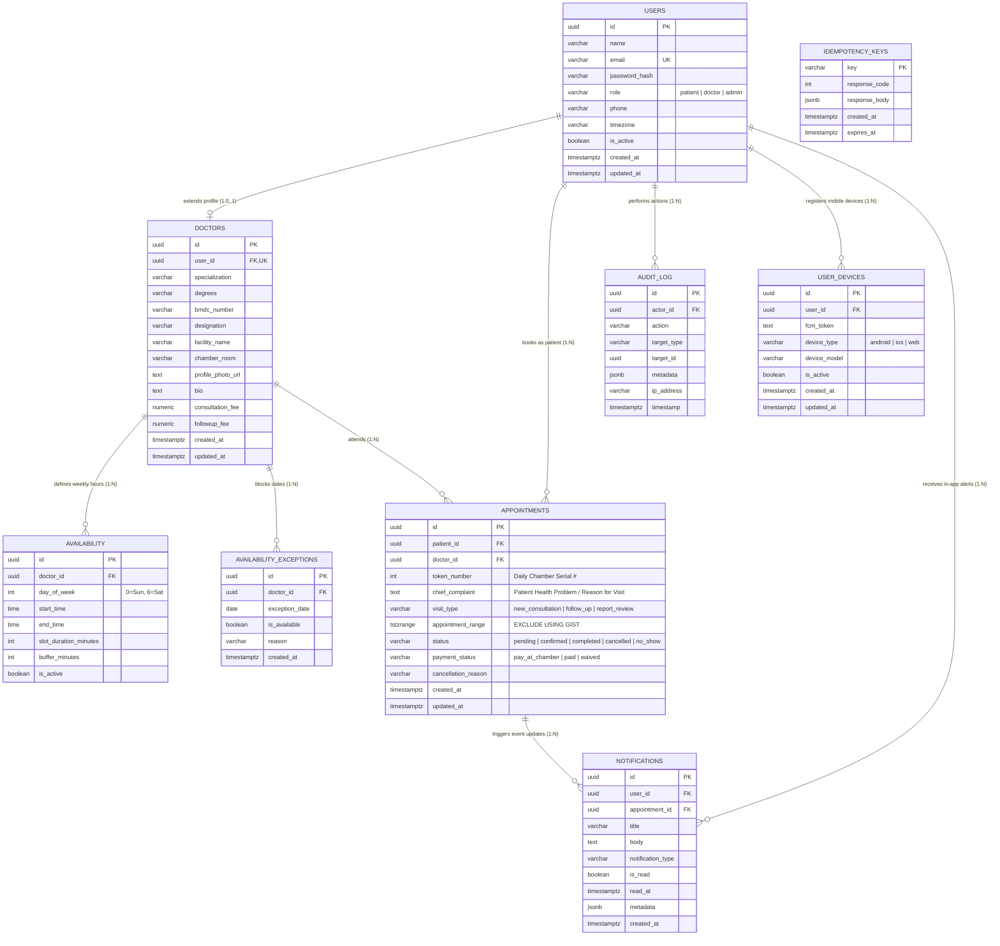

# 🗄️ CliniSync / ShebaSync — Database Design & Data Architecture
**System:** Real-Time Appointment Booking System (Web + Mobile)  
**RDBMS:** PostgreSQL 15+  
**Extensions:** `btree_gist`, `uuid-ossp`  
**Status:** Production-Ready & Locked

---

## 1. Entity-Relationship (ER) Diagram



---

## 2. Core Architectural Innovation: Zero Double-Booking Engine

### 2.1 The Race Condition Problem
In traditional booking applications, verifying availability is done using application queries:
```sql
-- FRAGILE / RACE-CONDITION PRONE (DO NOT USE)
SELECT COUNT(*) FROM appointments 
WHERE doctor_id = '...' 
  AND status = 'confirmed' 
  AND start_time < :new_end AND end_time > :new_start;
```
Under concurrent load (two patients tapping "Book" at the same second), **both transactions read 0 rows** and proceed to insert, causing a double-booking.

### 2.2 The PostgreSQL Kernel Solution (`btree_gist`)
We delegate concurrency control entirely to PostgreSQL's storage kernel using a **Range Exclusion Constraint**:
```sql
ALTER TABLE appointments ADD CONSTRAINT no_overlapping_appointments
EXCLUDE USING GIST (
    doctor_id WITH =,
    appointment_range WITH &&
) WHERE (status <> 'cancelled');
```

#### Why This Works Flawlessly:
1. **Physical Kernel Lock:** PostgreSQL's GiST index detects overlapping intervals (`&&`) atomically during write. If two transactions collide, the second transaction is immediately aborted with `SQLSTATE 23P01 (exclusion_violation)`.
2. **Half-Open Intervals `[start, end)`:** 
   * An appointment from `10:00` to `10:30` is stored as `[2026-09-10 10:00:00+00, 2026-09-10 10:30:00+00)`.
   * A back-to-back appointment from `10:30` to `11:00` is `[2026-09-10 10:30:00+00, 2026-09-10 11:00:00+00)`.
   * In PostgreSQL interval math, `[10:00, 10:30) && [10:30, 11:00)` evaluates to **`FALSE` (No overlap)**. Back-to-back slots work natively!
3. **Partial Index `WHERE (status <> 'cancelled')`:**
   * When an appointment is cancelled, it stays in the table for medical audit logs, but its time range is instantly released for other patients without deleting rows.

---

## 3. Data Dictionary (Complete Table Specifications)

### 3.1 Table: `users`
Represents all system actors (Patients, Clinicians, and Admins).
| Column Name | Data Type | Nullable | Default | Constraints / Description |
| :--- | :--- | :---: | :--- | :--- |
| `id` | `UUID` | No | `gen_random_uuid()` | Primary Key |
| `name` | `VARCHAR(255)` | No | - | User full name |
| `email` | `VARCHAR(255)` | No | - | Unique, normalized lowercase email |
| `password_hash` | `VARCHAR(255)` | No | - | Bcrypt hash ($\ge 12$ rounds) |
| `role` | `VARCHAR(20)` | No | - | `CHECK (role IN ('patient','doctor','admin'))` |
| `phone` | `VARCHAR(20)` | Yes | `NULL` | Contact phone number |
| `timezone` | `VARCHAR(50)` | No | `'UTC'` | User preferred timezone (e.g. `'Asia/Dhaka'`) |
| `is_active` | `BOOLEAN` | No | `true` | Account active flag |
| `created_at` | `TIMESTAMPTZ` | No | `now()` | Account creation time |
| `updated_at` | `TIMESTAMPTZ` | No | `now()` | Auto-updated on row modification |

### 3.2 Table: `doctors`
Stores professional clinical metadata, accreditation, and facility information linked 1-to-1 with a user record.
| Column Name | Data Type | Nullable | Default | Constraints / Description |
| :--- | :--- | :---: | :--- | :--- |
| `id` | `UUID` | No | `gen_random_uuid()` | Primary Key |
| `user_id` | `UUID` | No | - | FK -> `users(id)` ON DELETE CASCADE, Unique |
| `specialization` | `VARCHAR(100)` | No | - | Clinical department (Cardiology, Pediatrics, etc.) |
| `degrees` | `VARCHAR(255)` | No | `'MBBS'` | Medical qualifications (e.g. `MBBS, FCPS, MD`) |
| `bmdc_number` | `VARCHAR(50)` | No | - | Bangladesh Medical & Dental Council Reg # |
| `designation` | `VARCHAR(150)` | Yes | `NULL` | Academic/hospital title (e.g. `Senior Consultant`) |
| `facility_name` | `VARCHAR(255)` | No | - | Clinic / Hospital (e.g. `Popular Diagnostic`) |
| `chamber_room` | `VARCHAR(255)` | No | - | Chamber room & floor (e.g. `Room #402, Level 4`) |
| `profile_photo_url`| `TEXT` | Yes | `NULL` | High-res physician portrait image URL |
| `bio` | `TEXT` | Yes | `NULL` | Professional background and credentials |
| `consultation_fee`| `NUMERIC(10,2)`| No | `1200.00` | New consultation rate (Pay at Chamber) |
| `followup_fee` | `NUMERIC(10,2)`| No | `800.00` | Follow-up consultation rate |
| `created_at` | `TIMESTAMPTZ` | No | `now()` | Record creation timestamp |
| `updated_at` | `TIMESTAMPTZ` | No | `now()` | Auto-updated on row modification |

### 3.3 Table: `availability`
Defines recurring weekly shift templates and clinician rest buffers.
| Column Name | Data Type | Nullable | Default | Constraints / Description |
| :--- | :--- | :---: | :--- | :--- |
| `id` | `UUID` | No | `gen_random_uuid()` | Primary Key |
| `doctor_id` | `UUID` | No | - | FK -> `doctors(id)` ON DELETE CASCADE |
| `day_of_week` | `INT` | No | - | `CHECK (day_of_week BETWEEN 0 AND 6)` (0=Sun, 6=Sat) |
| `start_time` | `TIME` | No | - | Clinic shift start (e.g. `09:00`) |
| `end_time` | `TIME` | No | - | Clinic shift end (e.g. `17:00`) |
| `slot_duration_minutes` | `INT` | No | `30` | Duration per visit slot |
| `buffer_minutes` | `INT` | No | `0` | Rest gap padded after each slot for clinician charting |
| `is_active` | `BOOLEAN` | No | `true` | Rule active toggle |

### 3.4 Table: `availability_exceptions`
Stores one-off holiday dates, conferences, or emergency clinic blocks.
| Column Name | Data Type | Nullable | Default | Constraints / Description |
| :--- | :--- | :---: | :--- | :--- |
| `id` | `UUID` | No | `gen_random_uuid()` | Primary Key |
| `doctor_id` | `UUID` | No | - | FK -> `doctors(id)` ON DELETE CASCADE |
| `exception_date`| `DATE` | No | - | Specific date (e.g. `2026-09-15`) |
| `is_available` | `BOOLEAN` | No | `false` | `false` = Day off, `true` = Special open day |
| `reason` | `VARCHAR(255)` | Yes | `NULL` | Public or internal note (e.g., 'National Holiday') |
| `created_at` | `TIMESTAMPTZ` | No | `now()` | Logged timestamp |

### 3.5 Table: `appointments`
The central ledger of patient visits with database-enforced conflict prevention.
| Column Name | Data Type | Nullable | Default | Constraints / Description |
| :--- | :--- | :---: | :--- | :--- |
| `id` | `UUID` | No | `gen_random_uuid()` | Primary Key |
| `patient_id` | `UUID` | No | - | FK -> `users(id)` ON DELETE RESTRICT |
| `doctor_id` | `UUID` | No | - | FK -> `doctors(id)` ON DELETE RESTRICT |
| `appointment_range`| `TSTZRANGE`| No | - | `[start_time, end_time)` half-open interval |
| `status` | `VARCHAR(20)` | No | `'confirmed'` | `CHECK (status IN ('pending','confirmed','completed','cancelled','no_show'))` |
| `cancellation_reason`| `VARCHAR(255)`| Yes | `NULL` | Reason provided upon cancellation |
| `created_at` | `TIMESTAMPTZ` | No | `now()` | Booking creation timestamp |
| `updated_at` | `TIMESTAMPTZ` | No | `now()` | Auto-updated on status change |

### 3.6 Table: `idempotency_keys`
Prevents duplicate mobile requests, double-charges, and retry storms.
| Column Name | Data Type | Nullable | Default | Constraints / Description |
| :--- | :--- | :---: | :--- | :--- |
| `key` | `VARCHAR(255)`| No | - | Primary Key (Client UUIDv4) |
| `response_code`| `INT` | No | - | HTTP response code (e.g. 200, 201) |
| `response_body`| `JSONB` | No | - | Cached serialized response JSON |
| `created_at` | `TIMESTAMPTZ` | No | `now()` | Ingestion timestamp |
| `expires_at` | `TIMESTAMPTZ` | No | - | 24-hour expiration date |

### 3.7 Table: `audit_log`
Provides non-repudiation and regulatory compliance under Bangladesh Cyber Security Act.
| Column Name | Data Type | Nullable | Default | Constraints / Description |
| :--- | :--- | :---: | :--- | :--- |
| `id` | `UUID` | No | `gen_random_uuid()` | Primary Key |
| `actor_id` | `UUID` | Yes | `NULL` | FK -> `users(id)` ON DELETE SET NULL |
| `action` | `VARCHAR(100)`| No | - | Event tag (e.g. `APPOINTMENT_CANCELLED`) |
| `target_type`| `VARCHAR(50)` | No | - | Entity type (e.g. `appointment`, `doctor`) |
| `target_id` | `UUID` | Yes | `NULL` | ID of the affected resource |
| `metadata` | `JSONB` | Yes | `NULL` | Change delta or context payload |
| `ip_address` | `VARCHAR(45)` | Yes | `NULL` | Client IP address |
| `timestamp` | `TIMESTAMPTZ` | No | `now()` | Immutable timestamp |

---


### 3.8 Table: `user_devices`
Stores FCM/APNs push notification device tokens registered by the mobile apps.
| Column Name | Data Type | Nullable | Default | Constraints / Description |
| :--- | :--- | :---: | :--- | :--- |
| `id` | `UUID` | No | `gen_random_uuid()` | Primary Key |
| `user_id` | `UUID` | No | - | FK -> `users(id)` ON DELETE CASCADE |
| `fcm_token` | `TEXT` | No | - | FCM Registration Token |
| `device_type` | `VARCHAR(20)` | No | - | `android`, `ios`, `web` |
| `device_model` | `VARCHAR(100)`| Yes | `NULL` | Device manufacturer/model |
| `is_active` | `BOOLEAN` | No | `TRUE` | False if token is invalid/logged out |
| `created_at` | `TIMESTAMPTZ` | No | `now()` | Ingestion timestamp |
| `updated_at` | `TIMESTAMPTZ` | No | `now()` | Last token refresh |

### 3.9 Table: `notifications`
Stores persistent in-app notifications for the Notification Hub.
| Column Name | Data Type | Nullable | Default | Constraints / Description |
| :--- | :--- | :---: | :--- | :--- |
| `id` | `UUID` | No | `gen_random_uuid()` | Primary Key |
| `user_id` | `UUID` | No | - | FK -> `users(id)` ON DELETE CASCADE |
| `appointment_id`| `UUID` | Yes | `NULL` | FK -> `appointments(id)` ON DELETE SET NULL |
| `title` | `VARCHAR(255)`| No | - | Push banner & card header title |
| `body` | `TEXT` | No | - | Explanatory message body |
| `notification_type`| `VARCHAR(50)`| No | - | `booking_confirmed`, `queue_update`, `doctor_break`, `reminder_24h`, `reminder_1h`, `cancelled`, `system` |
| `is_read` | `BOOLEAN` | No | `FALSE` | Read / unread status badge |
| `read_at` | `TIMESTAMPTZ` | Yes | `NULL` | Timestamp when user opened/marked read |
| `metadata` | `JSONB` | Yes | `'{}'::jsonb` | Deep-link data (e.g. `tokenNumber`, `delayMinutes`) |
| `created_at` | `TIMESTAMPTZ` | No | `now()` | Dispatch timestamp |

---

## 4. Indexing & Query Optimization Strategy

| Index Name | Table | Type | Columns / Expressions | Optimization Purpose |
| :--- | :--- | :---: | :--- | :--- |
| `idx_users_email` | `users` | B-tree | `lower(email)` | Instant login lookup by email. |
| `idx_doctors_specialization`| `doctors` | B-tree | `specialization` | Fast filtering on doctor directory screen. |
| `idx_avail_doctor_day` | `availability` | B-tree | `doctor_id, day_of_week` | Fast retrieval of doctor's daily shift rules. |
| `idx_exceptions_lookup` | `availability_exceptions`| B-tree | `doctor_id, exception_date` | Fast check if doctor is on holiday. |
| **`no_overlapping_appointments`** | `appointments` | **GiST** | `doctor_id WITH =, appointment_range WITH &&` | **Kernel-level exclusion constraint.** |
| `idx_appointments_patient`| `appointments` | B-tree | `patient_id, created_at DESC` | Instant rendering of "My Bookings" in mobile. |
| `idx_appointments_doctor_date`| `appointments` | B-tree | `doctor_id, lower(appointment_range)` | Instant rendering of doctor's daily queue. |
| `idx_user_devices_active` | `user_devices` | B-tree | `user_id, is_active` | Instant lookup of active target device tokens for FCM push. |
| `idx_notifications_user_unread` | `notifications` | B-tree | `user_id, is_read, created_at DESC` | Instant rendering of patient's Notification Hub with unread badge. |
| `idx_notifications_created` | `notifications` | B-tree | `created_at DESC` | Efficient retention purge / archiving of historical notifications. |

---

## 5. Slot Calculation Query (How FastAPI Derives Available Slots)

```sql
-- Step 1: Check if date is blocked in exceptions
SELECT is_available FROM availability_exceptions 
WHERE doctor_id = :doctor_id AND exception_date = :target_date;

-- Step 2: Fetch active appointments for the target date to subtract from shifts
SELECT 
    id,
    lower(appointment_range) AS start_time,
    upper(appointment_range) AS end_time,
    status
FROM appointments
WHERE doctor_id = :doctor_id
  AND status <> 'cancelled'
  AND appointment_range && tstzrange(
        :target_date::timestamptz, 
        (:target_date + INTERVAL '1 day')::timestamptz
      );
```

FastAPI merges this with the doctor's weekly shift template, subtracts any booked ranges + buffers, and outputs the final available slot array.
